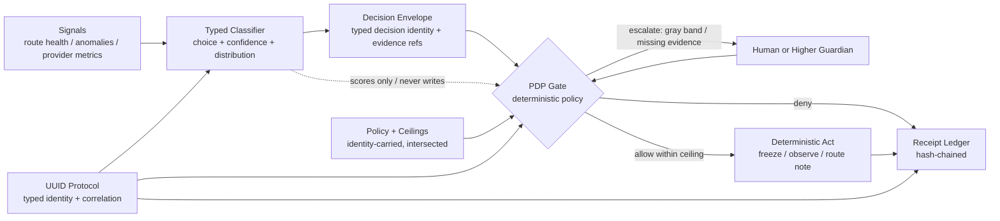

<!--
Ghost Catalog Header
file_id: SOM-DOC-10109-v1.0.0
name: guardian-sentinel-design-note
description: SoMaCo reference shape for a Guardian/Sentinel decision layer: typed classifier proposals gated by deterministic policy, capability ceilings, and hash-chained receipts.
category: design
tags: [guardian, sentinel, jev, system-one, pdp, uuid, receipts, governance]
status: design-note + runnable local harness
-->

# Guardian/Sentinel Decision Layer — Design Note

## Purpose

This note defines a SoMaCo reference shape for systems that need fast,
confidence-based classification without letting a model authorize value
movement or widen authority.

The motivating shape is a decentralized-exchange Guardian/Sentinel layer:
route health, anomaly classification, provider reliability, risk escalation,
and defensive response are assessed quickly, while hard authorization and
financial controls remain deterministic.

The SoMaCo answer is not “put a classifier in charge.” It is:

> The classifier proposes. Deterministic policy disposes. Every material
> proposal, gate decision, and act writes a receipt before the act is treated
> as real.

## Protocol Fit

The SoMaCo UUID protocol fits this shape as the identity and correlation
substrate, not as a credential system.

- **Typed identities:** routes, providers, actors, policies, decisions, and
  receipts each carry typed identities. A route identity names the route; a
  provider identity names the provider; a decision identity names one
  classifier output; a receipt identity names one witnessed gate/act record.
- **Identity is address, never authority:** a UUID identifies and correlates.
  It never grants permission by itself. Authority comes from policy, role,
  ceiling, and gate outcome.
- **Capability ceilings ride with identity:** each actor identity carries a
  ceiling profile: allowed act classes, maximum value at risk, allowed scopes,
  expiry/generation, and whether it can freeze, escalate, observe, or merely
  propose.
- **Ceilings intersect, never union:** when actor, parent, policy, venue, and
  session ceilings are combined, the effective authority is the intersection.
  A child or delegated sentinel can only narrow authority, never widen it.
- **Registry issues, never resolves:** the registry can issue typed identities
  and record receipts. It does not decide whether a route is safe, whether a
  provider is reliable, or whether a freeze should happen. Resolution happens
  at the policy gate and in the evidence record.
- **Attenuation down lineage:** a spawned sentinel inherits a subset of its
  parent’s ceiling. TTL, scope, and act class can shrink down the lineage;
  they cannot grow.
- **Sentinel-only defensive authority:** freeze/kill authority is a narrow
  defensive act class. A sentinel may freeze within ceiling; it cannot
  unfreeze, move funds, widen limits, or mint authority. Unfreeze is a separate
  deterministic act with stronger requirements.

## Architecture

## Flow

1. **Sense.** The system collects deterministic facts first: route latency,
   failure counts, provider status, liquidity bounds, signed oracle/config
   state, and prior receipts. Mechanical facts do not need a model call.
2. **Classify.** A typed classifier returns a finite choice, confidence, and
   probability distribution. Example choices: `route_ok`, `route_degraded`,
   `provider_suspect`, `anomaly_unknown`, `escalate_risk`.
3. **Envelope.** The classifier output is wrapped in a decision envelope with:
   decision identity, subject identity, actor/proposer identity, choice,
   confidence, distribution, evidence references, timestamp, and model/version
   pin when a live classifier is used.
4. **Gray band.** Low confidence is not a weak yes. Below the floor, the
   proposal is observe/deny. Inside the gray band, the proposal escalates.
   Above the band, the proposal may proceed to deterministic checks; it still
   does not authorize by itself.
5. **Gate.** The PDP checks deterministic policy: act class, actor ceiling,
   parent ceiling, venue/session ceiling, value limits, scope, TTL, required
   evidence, and forbidden acts. Forbidden acts deny regardless of confidence.
6. **Act.** Only deterministic actuators perform allowed acts. The classifier
   never writes to the actuator path.
7. **Witness.** The proposal, gate decision, and act result are appended to a
   hash-chained receipt ledger. If the receipt cannot be written, the act is
   not treated as witnessed; in production policy this should fail closed for
   material acts.
8. **Review.** Operators can replay the chain: signal -> decision envelope ->
   gate outcome -> act -> receipt. The audit record is the decision record,
   not a reconstructed log.

## Decision Classes for the DEX Shape

| Signal | Classifier proposal | Deterministic gate | Allowed act examples |
|---|---|---|---|
| Route latency/failures spike | `route_degraded` | route in scope, sentinel can freeze, value under ceiling | freeze route, force observe-only, escalate |
| Provider misses heartbeats | `provider_suspect` | provider ceiling, evidence count, age of data | quarantine provider, reduce weight via deterministic rule |
| Unknown anomaly pattern | `anomaly_unknown` | gray band by construction | escalate; no act beyond observe |
| Risk limit approached | `escalate_risk` | deterministic limit table owns threshold | escalate, freeze if hard limit crossed |
| Request to move funds | not a classifier act | hard authorization path only | deterministic multisig/policy flow; classifier cannot allow |
| Request to widen limit | not a classifier act | forbidden to sentinel/classifier | deny or route to governance process |

## What Exists Today vs New vs Future

### Exists today in the estate

- **NGOV-style PDP/witness pattern in Imbue:** governed acts climb a policy
  decision point, are witnessed in a ledger, and only then move state. The DNS
  governance code is one concrete instance of decide-and-witness before
  mutation.
- **imbue-decide Jev client shape:** a typed System One/Jev client pattern with
  choice + confidence + distribution, costed decision ledger concepts, gray
  band handling, and typed not-configured states. This design reuses the
  interface shape; it does not claim the DEX harness calls live Jev today.
- **Posture/policy packs pattern:** signed policy packs and staged diffs show
  how policy can be carried, reviewed, and applied with receipts instead of
  silently mutating local state.

### New in this reference shape

- A compact Guardian/Sentinel vocabulary for route/provider/anomaly/risk
  decisions outside the Imbue desktop surface.
- A worked separation between classifier proposal, PDP gate, deterministic act,
  and receipt witness for defensive automation.
- A local harness proving the flow with a deterministic stub classifier,
  gray-band escalation, hard-ceiling denial, freeze act, and receipt-chain
  verification.

### Named future

- Live classifier swap through the TypeSafe/Jev connector or another typed
  classifier behind the same envelope.
- Production key management, signer identity, and external anchoring of the
  receipt chain.
- Venue-specific adapters for DEX routing, provider registries, smart-contract
  pause modules, and incident tooling.
- Human approval UX for gray-band escalation and unfreeze flows.
- Formal policy language and conformance tests against real Guardian/Sentinel
  deployments.

## Non-Claims

- This design does not claim a production DEX integration.
- This design does not claim the classifier is accurate; it claims the
  authority boundary is explicit even when classification is uncertain.
- This design does not make UUIDs into credentials.
- This design does not let confidence move funds, widen limits, unfreeze
  routes, or override deterministic controls.
- A hash chain proves tamper evidence inside the ledger; production systems
  still need signer/anchoring choices appropriate to their threat model.

## Answers to the DEX Shape

- **Fast decisions are fine if they are typed and bounded.** Route health,
  anomaly class, provider reliability, and escalation can be classifier
  proposals; authorization remains deterministic.
- **The audit trail is a chain of receipts, not a postmortem.** Each decision
  carries identity, evidence refs, confidence/distribution, gate outcome, and
  act result.
- **Defensive power must be narrow.** A sentinel can freeze within ceiling; it
  cannot unfreeze, move funds, or widen its own authority. That is what makes
  the automation safe to deploy.
